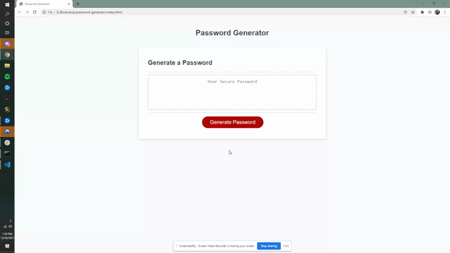

# password-generator

## Project Overview

This application enables a user to generate random passwords based on criterias that they have selected. This app will run in the browser and features dynamic HTML and CSS (with starter code) powered by Javascript that I have coded.
 

## Installation

Tools Needed:

1. Terminal (MacOS) or
   [GitBash](https://gitforwindows.org/) (Windows)
2. Have a Github account (Not Required)
3. Install text editor of your choice (e.g. VSCode, Atom, etc.)

How to view the project:

1. Navigate in terminal/gitbash where you want to save the project
2. Clone the project via HTTPS or SSH link found in my GitHub repo 
    https://github.com/plotinusspascual/password-generator
3. After entering the command 'git clone [HTTPS/SSH Link]' in terminal, use command 'code .' to open the project in your default text editor
4. Right click on 'Index.html' and view in live browser to see the website 

## Features

- When a user clicks the button to generate a password, they are presented with a series of prompt for a password criteria
- User can select which criteria they want to include in their password
- User will be prompted how long the password will be, at least 8 characters long and no longer than 128
- If out of bounds of the length, it will alert the user the correct bounds and start over
- User will be prompted a series of questions of which they will answer if they want uppercase, lowercase, numbers, or special characters in their password. 
- When all prompts are answered, a password wil generate that matches the selected criteria
- After generating a password, the password will be written to the page 

## Images 

Below is a gif showcasing some of the elements and functions of my website. 

## Built With

* [HTML](https://developer.mozilla.org/en-US/docs/Web/HTML)
* [CSS](https://developer.mozilla.org/en-US/docs/Web/CSS)
* [Javascript](https://developer.mozilla.org/en-US/docs/Web/Javascript)

## Deployed Link

* [See Live Site](https://plotinusspascual.github.io/password-generator/)

## Authors

* **Jose Pascual** 

- [Link to Github](https://github.com/plotinusspascual)
- [Link to LinkedIn](https://www.linkedin.com/in/jose-plotinuss-pascual/)

## License

This project is licensed under the MIT License 

## Contributing

If there are anything I missed or could have done more efficiently please feel free to message me directly through Github

© 2021 Trilogy Education Services, LLC, a 2U, Inc. brand. Confidential and Proprietary. All Rights Reserved.